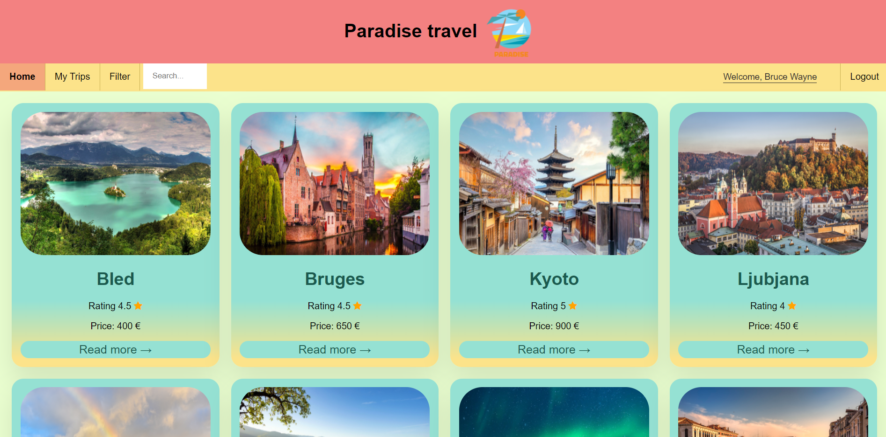
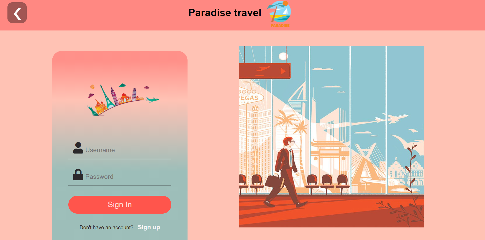
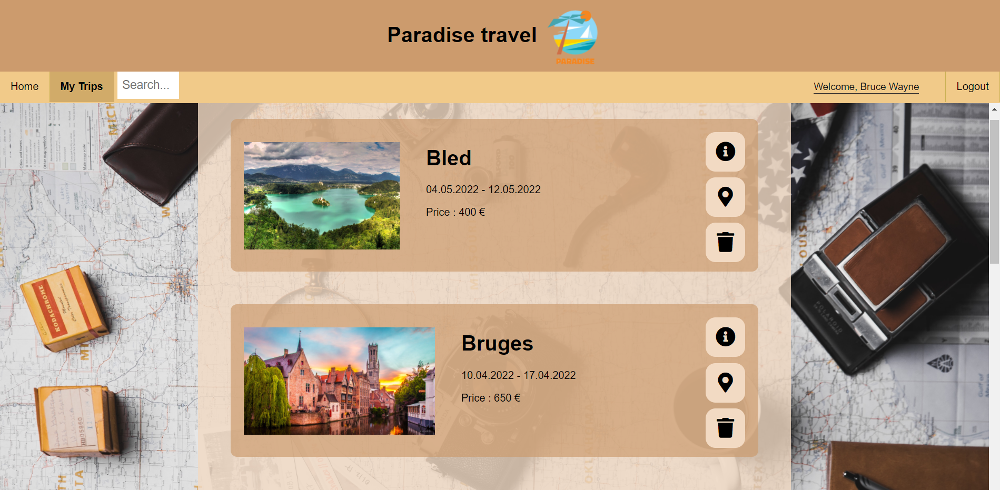
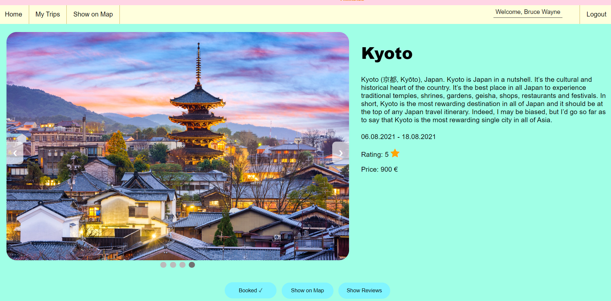
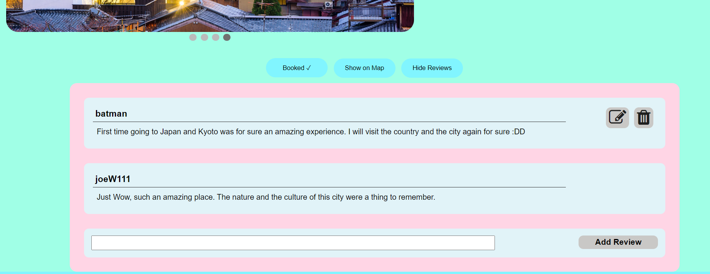
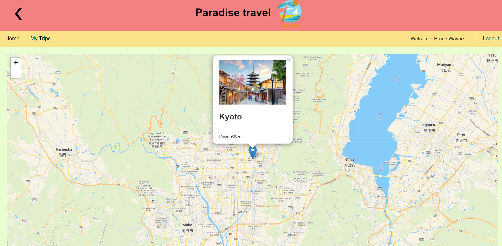

# Paradise travel
----

## Description
Paradise travel is a web application that allows for users to search, review and book different trips.

## Home page
When you start the application you are presented with all the available trips. You can filter or search trips by name.

## Login
This application supports user login and sign up. There are some parts of the application that are restricted for non logged in users.

## My Trip
If a user is logged in they can view a list of their booked trips. From here they can either view information about a trip, the location on a map and they can delete trips.

## Cities
Any user can look extra information about a trip. From here they can see reviews, they can open up and view the location of the trip on a map, and they can book the trip.

## Reviews
All users can read the reviews. A logged in user can add, edit and delete their own reviews.

## Map
The user has also the option to view the trip on a map. Also from here they can book the trip.

## Technologies
Technologies used for this project were:

- HTML
- CSS
- JavaScript
- PHP
- MySQL
- jQuery
- Ajax
- Leaflet library

## Other
If you import the database, you already have 4 existing users:
 - __username : password__:
    - batman : ilovebats
    - joeW111 : testpasswd
    - superman007: stvaje
    - admin : admin